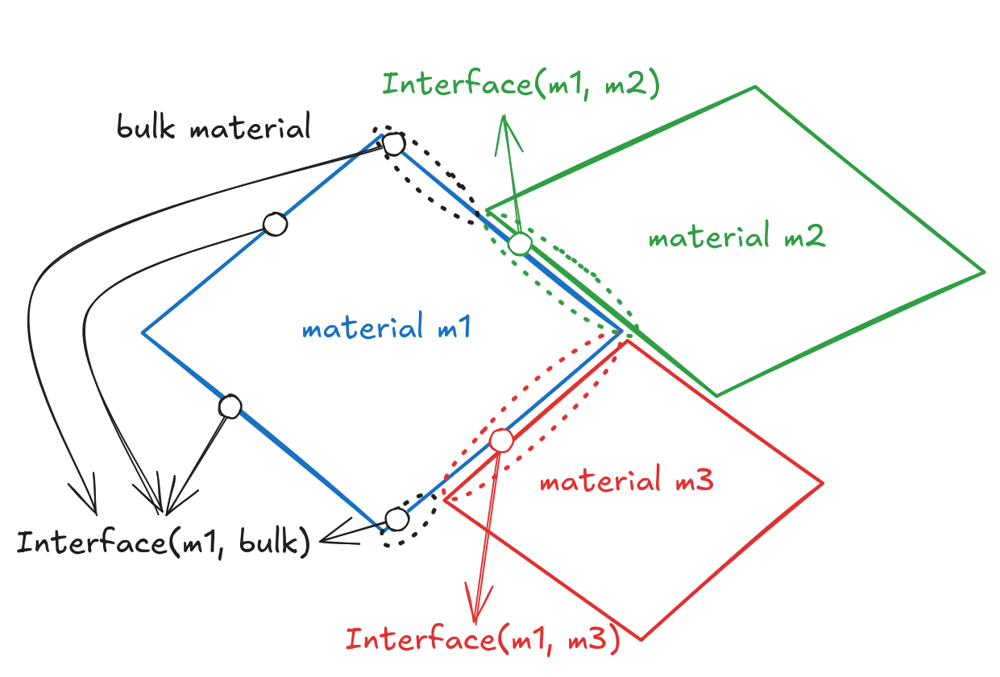
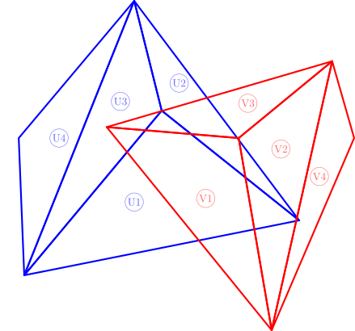

# Mesh Splitting Algorithm

This crate implements a method to split the meshes when the intersecting faces
are coplanar. This allows the geometry to match at the interfaces of the meshes,
which enables ray tracing for translucent materials reliably.

In the following diagram, we can see that for the face on the mesh, this might
have the outside material defined non-uniformly. Hence, coplanar faces
intersection is necessary to identify how to split this faces to define their
outside material correctly on their sub-mesh.

For each coplanar intersection of 2 meshes $\mathcal{M}_i$ and $\mathcal{M}_j$, such that

$$\mathcal{M}_{ij} = \mathcal{M}_i \cap \mathcal{M}_j \neq \emptyset$$

the meshes are split in two parts, such that the overlapping region is
identical.

$$\mathcal{M}_{i} \rightarrow \{ \mathcal{M}_{i} \setminus \mathcal{M}_{j}, \mathcal{M}_{ij} \}$$
$$\mathcal{M}_{j} \rightarrow \{ \mathcal{M}_{j} \setminus \mathcal{M}_{i}, \mathcal{M}_{ij} \}$$

Then each triangle of the intersection has the attribute interface set such that
the outside material is the inside of the other mesh and vice-versa.

$$
\text{Outside}(T^{(i)}_{ij}) = \text{Inside}(T^{(j)}_{ij}) \qquad \forall  T_{ij} \in \mathcal{M}_{ij}
$$ 

## Implementation: Co-planar mesh splitting

### Surface splitting

An object surface is described as a closed mesh, formed of polygons
(specifically triangles in our case).
Each surface has an attribute described in @def-surface-attribute, which can be an interface between
two materials, a reflector, a mirror or a detector.

When two objects are adjacent to each other, their meshes can be co-planar at the boundary of their
intersection. In the case where one of the attributes is `Interface`, then the meshes need to be split
such that we decide how rays refract/reflect at these interfaces. Otherwise, the rays are not expected
to cross these planes and be influence by the other mesh.

The splitting function $\mathbf{S}$ over the pair $\mathnormal{M}_u$ and
$\mathnormal{M}_v$ produces two sets, the mesh without the intersection such
that attributes are preserved and the intersection mesh where the interface
needs to be matched.

$$
\mathbf{S}:\mathnormal{M}^2 \rightarrow \mathnormal{M}^2 ,\quad
\mathbf{S}(\mathnormal{M}_u, \mathnormal{M}_v) = (\mathnormal{M}_u \setminus \mathnormal{M}_v, \mathnormal{M}_u \cap \mathnormal{M}_v)
$$

$$
\mathbf{S}(\mathnormal{M}_u, \mathnormal{M}_v) = \bigcup_{T_u \in \mathnormal{M}_u} \bigcup_{T_v \in \mathnormal{M}_v} \mathbf{S}(T_u, T_v)
$$

where $\bigcup_{T_u \in \mathnormal{M}_u} \bigcup_{T_v \in \mathnormal{M}_v}
\mathbf{S}(T_u, T_v)$ is the union of the splitting of all triangle pairs from
the two meshes and the operation is defined as

$$
\bigcup_{i} \bigcup_{j} (\mathnormal{S}^{(1)}_i, \mathnormal{S}^{(2)}_j) = (\bigcup_{i} \mathnormal{S}^{(1)}_i, \bigcup_{j} \mathnormal{S}^{(2)}_j)
$$

We require that calling $\mathbf{S}(\mathnormal{M}_u, \mathnormal{M}_v)$ and
$\mathbf{S}(\mathnormal{M}_v, \mathnormal{M}_u)$ produces the same intersection.
In order to preserve this property we can instead return the primitive splitting
elements used to create the intersection meshes.

> [!TIP]
> The splitting function can return early, by running a collision test as
> discussed in "Ericson: Real Time Collision Detection 2004" using bounding boxes or a
> BSP tree to determine if the meshes intersect or not, and only run the splitting
> if they do.

We define the splitting primitives $\mathcal{P}$ as all segments used for
splitting the target triangles, which can be directly transformed in the
intersection, defined as the set of triangles formed by these segments.

$$
\begin{aligned}
\mathcal{P}_{T_u \cap T_v} = \{\, S \mid S = &(p_{start}, p_{end}) \in \mathbf{T}_{u\cap v} = 
T_u \cap T_v \text{ for some } T_u \in \mathnormal{M}_u, T_v \in \mathnormal{M}_v \} \\
&\text{where}\, p_{start}, p_{end} \in \mathbb{R}^{d}
\end{aligned}
$$

Then we can define the triangle conversion functions of the set of primitives
as

$$
\mathcal{T}(\mathcal{P}_{T_u \cap T_v}) = T_u \cap T_v
$$

Then it is more useful for us to define another splitting function
$\tilde{\mathbf{S}}$

$$
\tilde{\mathbf{S}}:\mathnormal{T}^2 \rightarrow \mathnormal{T} \times \mathcal{P} ,\quad \tilde{\mathbf{S}}(T_u, T_v) = (T_u \setminus T_v, \mathcal{P}_{T_u \cap T_v})
$$

The primitives are then reused to split the other triangle, preserving
compatible geometry at the interface

$$
\hat{\mathbf{S}}:\mathnormal{T}\times\mathcal{P} \rightarrow \mathnormal{T} \times \mathcal{P} ,\quad
\hat{\mathbf{S}}(T_v, \mathcal{P}_{T_u \cap T_v}) = (T_v \setminus T_u, \mathcal{P}_{T_u \cap T_v})
$$

#### Mesh splitting primitives

For triangle splitting is easy to think of as a set of edges resulting from
intersecting two triangles, however, the similar concept might not be compatible
to construct from the meshes point of view.

Firstly, what would be the splitting primitive $\mathcal{P}_{M_u \cap M_v}$ such
that a mesh functional $\mathcal{M}(\mathcal{P}_{M_u \cap M_v}) = M_u \cap M_v$
can convert it to the intersection mesh?

Secondly, how should the splitting function be defined to achieve consistent
results between $\tilde{\mathbf{S}}(\mathnormal{M}_u, \mathnormal{M}_v)$ and
$\hat{\mathbf{S}}(\mathnormal{M}_v, \mathcal{P}_{M_u \cap M_v})$?

::: {.callout-note}
$\mathbf{S}(\mathnormal{M}_u, \mathnormal{M}_v)$ and
$\tilde{\mathbf{S}}(\mathnormal{M}_v, \mathcal{P}_{M_u \cap M_v})$ are
compatible by the definition of $\mathcal{P}_{M_u \cap M_v}$.
:::

The splitting primitive can be the union of all the cross mesh intersection
primitives as defined in:

$$
\mathcal{P}_{M_u \cap M_v} = \bigcup_{T_u \in \mathnormal{M}_u} \bigcup_{T_v \in \mathnormal{M}_v} \mathcal{P}_{T_u \cap T_v}
$$

> [!WARNING]
> While we run the splitting on the triangle we know the splitting primitive would
> only apply to other triangle used to split the target triangle rather than the
> whole mesh, therefore having constant $O(1)$ complexity for each split, but in
> the case of propagating all the primitives up and then split again on the other
> mesh would result in $O(n)$ complexity for each split, therefore $O(n)$ vs
> $O(n^2)$.

#### Mesh construction by mapping of features

For construction purposes and to avoid doing an expensive k-dimensional
coordinates equality check for matching the vertices position, we hold each
verts position in a $\mathcal{V}$ list and use the index of the vertex for
construction in each of the subsequent features: edges $\mathcal{E}$,
faces/polygons $\mathcal{F}$ and meshes $\mathcal{M}$.

Hence, matching vertices is done based on an identifier rather than comparing floating
points. This mitigates problems in operation with floating point errors,
avoiding openings in the mesh and computationally lighter to compute matches.

For barycentric coordinates on triangles to determine their surface normal, they
might be described as an interpolation between normals from its vertices.
Therefore, we also hold a list of normals $\mathcal{N}$.

#### Grouping splitting/intersection primitives

In order to keep the intersections consistent the intersection primitives are
used to split the other triangle, therefore, the primitives are grouped by the
triangle they are splitting. For example, in
@fig-triangle_polygons_split_primitives, while splitting $M_U$ by $M_V$, the
triangle $T_{U1}$ is split by $T_{V1}$, $T_{V2}$ and $T_{V3}$, producing the
intersection primitives $P_{U1 \cap V1}$, $P_{U1 \cap V2}$ and $P_{U1 \cap V3}$,
which are collected, keeping track of the triangles intersections that produced
them, and returned for use of splitting the mesh $M_V$.

> [!TIP]
> The intersection primitives are a set of polygons, which for the purpose of the
> `aetherus` project are chosen to be triangulated ahead of time, such that
> produced meshes only use triangles.

 

Then, the splitting function is

$$
\bar{\mathbf{S}}:\mathnormal{T}\times M \rightarrow \mathnormal{T} \times \mathcal{P} ,\quad
\bar{\mathbf{S}}(T_u, M_v) = (T_u \setminus M_v, \mathcal{P}_{T_u \cap M_v})
$$

$$
\mathcal{P}_{T_u \cap M_v} = \{\,(P, i) \, | T_u \in M_u ,\, \mathcal{F}[i] \in
M_v ,\, P = T_u \cap \mathcal{F}[i] \neq \emptyset  \}
$$

Expanding this functionality at the meshes level looks like:

$$
\bar{\mathbf{S}}: M \times M \rightarrow \mathnormal{M} \times \mathcal{P} ,\quad
\bar{\mathbf{S}}(M_u, M_v) = (M_u \setminus M_v, \mathcal{P}_{M_u \cap M_v})
$$

$$
\begin{aligned}
\mathcal{P}_{M_u \cap M_v} &= \{\,(P, i) \, | T_u \in M_u ,\, T_v = \mathcal{F}[i] \in
M_v ,\, P \in \mathcal{P}_{M_u \cap T_v} ,\, M_u \cap T_v \neq \emptyset  \} \\
\mathcal{P}_{M_u \cap T_v} &= \{\, P \,|\, (P, i) \in \mathcal{P}_{T_u \cap M_v} ,\, T_v = \mathcal{F}[i] \in M_v \}
\end{aligned}
$$

Which make the splitting of mesh $M_v$ trivial to proceed since for a triangle
$T_v = \mathcal{F}[i]$ we can directly get all intersection primitives $P$ that
are used to split it by looking at the list of primitives $\mathcal{P}_{T_u \cap
M_v}$ and checking for the index $i$ of the triangle $T_v$ from the list
$\mathcal{F}$.

> [!NOTE]
> We can determine $\mathcal{P}_{M_u \cap V_1}$ in @fig-coplanar_triangles_splitting_primitives as follows:
> 
> - The intersections with triangle $U_1$ are $\bar{\mathbf{S}}(U_1, M_v) = \{ P_{U_1 \cap V_1}, P_{U_1 \cap V_2}, P_{U_1 \cap V_3} \}$
> - Then run the intersections with the other triangles. We are particularly
> interested in triangles $U_2$ and $U_3$ which have an intersections with $V_1$
> - Finally, collect the intersections for $V_1$ from $\bar{\mathbf{S}}(U_2, M_v)$
> and $\bar{\mathbf{S}}(U_3, M_v)$, which results in $\mathcal{P}_{M_u \cap U_1} = \{ P_{U_1 \cap V_1}, P_{U_2 \cap V_1}, P_{U_3 \cap V_1} \}$ shown in orange

### Surface attribute matching

Now that we have the intersection mesh, there are 4 cases that are worth
considering in terms of the attribute value of the surface described by the
meshes.

- ($\mathcal{M}_u$: Interface, $\mathcal{M}_v$: Interface): The intersection
mesh $\mathcal{M}_{u \cap v}$ is an interface between the two materials
described in the attributes of the meshes. The outside material of one is the
inside of the other and vice-versa which is equivalent to:

$$
\begin{cases}
\text{Outside}(\mathcal{M}^{(u)}_{u \cap v}) = \text{Inside}(\mathcal{M}_v) \\
\text{Outside}(\mathcal{M}^{(v)}_{v \cap u}) = \text{Inside}(\mathcal{M}_u)
\end{cases}
$$

- ($\mathcal{M}_u$: Interface, $\mathcal{M}_v$: {Reflector, Mirror, Detector}):
The intersection mesh $\mathcal{M}_{u \cap v}$ is discarded for $\mathcal{M}_u$
splitting while $\mathcal{M}_v$ is not split

$$
\begin{cases}
\mathbf{S}(\mathnormal{M}_u, \mathnormal{M}_v) = (\mathnormal{M}_u \setminus \mathnormal{M}_v, \emptyset) \\
\mathbf{S}(\mathnormal{M}_v, \mathnormal{M}_u) = (\mathnormal{M}_v, \emptyset)
\end{cases}
$$

- ($\mathcal{M}_u$: {Reflector, Mirror, Detector}, $\mathcal{M}_v$: Interface):
  Same thing as the previous case, but in reverse
- ($\mathcal{M}_u$: {Reflector, Mirror, Detector}, $\mathcal{M}_v$:  {Reflector, Mirror, Detector}): No splitting is performed

$$
\begin{cases}
\mathbf{S}(\mathnormal{M}_u, \mathnormal{M}_v) = (\mathnormal{M}_u, \emptyset) \\
\mathbf{S}(\mathnormal{M}_v, \mathnormal{M}_u) = (\mathnormal{M}_v, \emptyset)
\end{cases}
$$

### Triangle splitting

For the triangle-triangle splitting function $\mathbf{S}(T_u, T_v)$, we consider
all the different splitting cases in the following section in order to
extensively test the procedure. Furthermore, in this scenario, the intersection
polygons are triangulated before passing them as function results.

> [!TIP]
> Intersection of two convex polygons (triangles in this case) will be a convex
> polygon. Therefore, triangulation can be done simply using the fan method,
> connecting one vertex to all other non-adjacent vertices, but a better choice
> might be a MaxMin triangulation @keilAlgorithmMaxMinArea2003
> @keilAlgorithmsOptimalArea2006

#### Cases

1. **Resolved @fig-resolved_tris_split:**  $(1,1)$
2. **Edge collinear @fig-colinear_edges:**
    - (a) Two edges collinear
        - (i) One edge is the same: $(2,1)$
        - (ii) Edges are collinear, but not the same: $(3,1)$
    - (b) Vertex out: $(1,1)$
    - (c) Vertex in:
        - (i) $v_1 = u_1$ and $v_2 = u_2$: $(3,1)$
        - (ii) $v_1 = u_1$, $v_2 \in (u_1, u_2)$: $(4,1)$
        - (iii) $\{v_1, v_2\} \in (u_1, u_2)$: $(5,1)$
3. **Vertex in = 1 ($v_1$) @fig-vertex_in_1:**
    - (a) $[v_1,v_2]$ and $[v_1,v_3]$ intersect same $U$ edge: (5,3)
    - (b) $[v_1,v_2]$ and $[v_1,v_3]$ intersect distinct $U$ edges
        - (i) $[v_2, v_3]$ not intersecting $U$: (5,5)
        - (ii) $[v_2, v_3]$ intersects two distinct edges of $U$: (7,5)
    - (c) One edge of $V$ triangle contains $U$ vertex: $(4,3)$
    - (d) Two edges of $V$ triangle contain $U$ vertices: $(3,3)$
4. **Vertex in = 2 ($v_1, v_2$) @fig-vertex_in_2:**
    - (a) $[v_1,v_3]$ and $[v_2,v_3]$ intersect $U$ edges
        - (i) Same $U$ edge: $(7,3)$
        - (ii) Two distinct $U$ edges: $(7,5)$
    - (b) One edge of $V$ contains $U$ vertex: $(6,3)$
5. **Vertex in = 3:** $(7,1)$
6. **Vertex in = 0 @fig-vertex_out:**
    - (a) Two edges of $V$ each intersect with any two edges of $U$
        - (i) Vertex of $U$ inside $V$: $(5,7)$
        - (ii) Vertex of $U$ on edge of $V$: $(5,6)$
    - (b) One edge of $V$ intersects with two edges of $U$
        - (i) One vertex of $U$ on edge of $V$: $(3,6)$
        - (ii) Two vertices of $U$ on edges of $V$: $(3,5)$
        - (iii) Two vertices of $U$ inside $V$: $(3,7)$
    - (c) Three edges of $V$ intersect three edges of $U$: $(7,7)$

